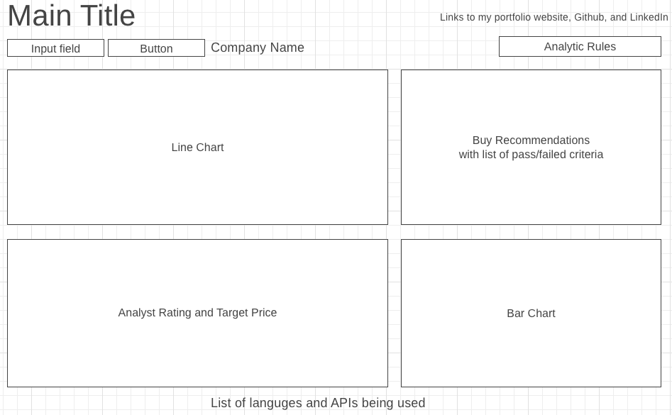

# ResearchOrSwim  

**Background:**

ReserchOrSwim is a stock investing analytic dashboard based on momemtum and fundamental principles. The dashboard provides a single-page view to users that includes chart with price moving average for momentum investing, year-over-year(YoY) earnings for fundamentals investing, and Wallstreet expectation level based on analyst ratings and target price. 

In addition, based on data that used to construct the aforementioned charts, it also performs passed/failed analysis and recommend a 'buy' only if it passed all test levels.

This dashboard provides great benefits to investors who implement investment strategies strictly based on defined rules, rather than sentiments. In addition, this dashboard makes research as simple as just one click away as the key criteria are all in one dashboard.

---

**Functionality & MVPs:**

In ReserchOrSwim, users will be able to:

- Input ticker symbol for analytics.
- View stock price chart with 30-days moving average.
- View Year-over-Year(YoY) earning for the last three year in a bar chart.
- View a list of analyst ratings with target price.
- View if the stock passed/failed the following conditions:  
  1. 30-days moving average trending upward.
  2. YoY earning is positive and 15% growth each year.
  3. Average target price from analyst rating is 15% more than current price.

In addition, this project will include:
- A page where the passed/failed logic being used.  
- links to my portfolio website, Github, and LinkedIn
- List of technologies / libraries / APIs used
- a production README

Recommendation logic:
- Price momentum: 
    1. passed only if price moving average from last 30 days and increasing.
- Company Earnings:
    1. passed only if earning is positive and YoY growth in the last two years is 10% or more.
- Analyst Recommendation:
    1. passed only if 75% recommended Strong Buy or Buy.
- Analytical:
    1. passed only if all three tests above received a pass. 

---

**Wireframes**

https://wireframe.cc/Rc4xee

- The input field is a field where user can enter the ticker symbol for lookup
- Once clicked on the button with a valid ticker, the page will load without refreshing the page (AJAX and event listener).
- The Analytic Rules button shows the passed/failed logic being used.
- The line chart displays a one-year timeframe line chart with 30-days moving average.
- The Buy Recommendation section displays analytic results after the passed/failed logic being performed.
- The bar chart displays the YOY earnings for last three years.
- Analyst Rating and Target price is a table with recommendations from financial institutions and the respective target price.

---

**Technologies, Libraries, APIs**

- **D3.js library** for price chart with moving average, and YoY earnings.
- **Iexcloud** - for stock data API for historical stock data, including price, analyst rating and target price and earnings.
- **Vanilla Javascript** for computing logics for Recommendations.
- **CSS** for styling.
- **Webpack** for bundle js files.
- **AJAX**  update contents without refreshing the browser.

**Backend**? - to be determined. Need more research on Iexcloud and D3 and then  then determine whether backend is needed.

---

**Implementation Timeline**

- Friday Afternoon & Weekend: 
    1. ~~Set up project.~~ 
    2. ~~Get D3 show up and IEXcloud connected and able to retrieve data.~~ 
    3. Complete coding the input form and header.
    4. Complete high-level project plan and logics.
    5. Deep dive into D3 and IEXcloud API.
- Monday:
    1. Get the line, bar charts, and table show up correctly.
- Tuesday: 
    1. Implemente underlying logic for the Recommendation section.
- Wednesday:
    1. CSS and styling.
    2. deployment.
- Thursday Morning:
    1. Update README

