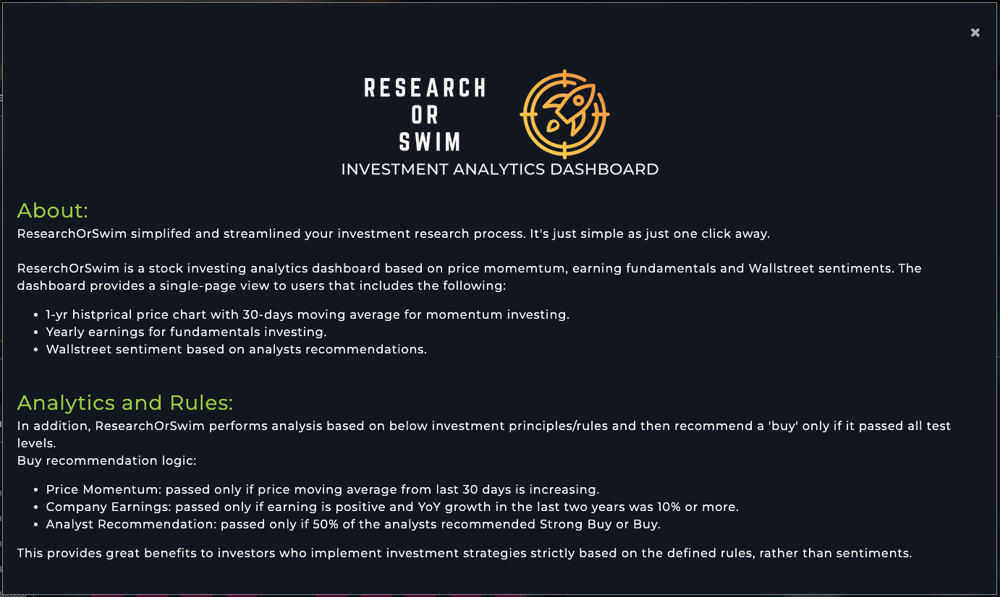
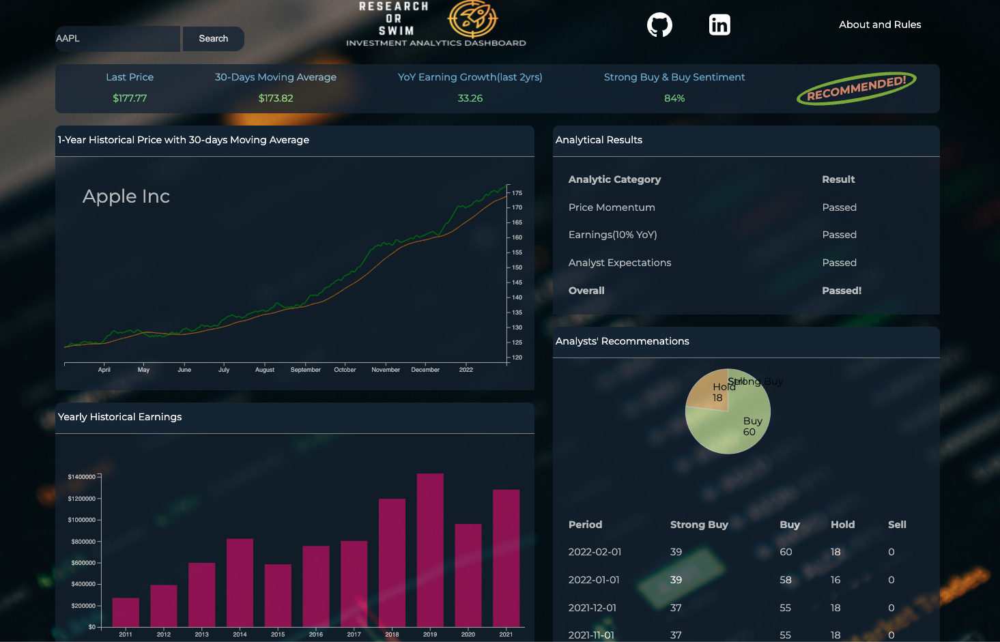

# ResearchOrSwim  

**Background:**

ReserchOrSwim is a stock investing analytics dashboard based on price momemtum, earning fundamentals and Wallstreet sentiments. It simplifed and streamlined your investment research process. It's just as simple as just one click away.

---

[Checkout ResearchOrSwim and do your investment due diligence painlessly](https://swusteven.github.io/ResearchOrSwim/)

---
**Functionalities:**

In ReserchOrSwim, users will be able to:

- Search by stock symbol in the upper left search field and then search. ResearchOrSwim will do all the works for you.
- Analytics result will display in the upper right section: Recommended or Not Recommended(see below for analytics rules)
- Search again if want to check out another company.

- The dashboard provides a single-page view to users that includes the following:
    
    - 1-yr histprical price chart with 30-days moving average for momentum investing.
    - Yearly earnings for fundamentals investing.   
    - Wallstreet sentiment based on analysts recommendations.
   

**Analytics rules:**
- Price momentum: 
    1. passed only if price moving average from last 30 days and increasing.
- Company Earnings:
    1. passed only if earning is positive and YoY growth in the last two years is 10% or more.
- Analyst Recommendation:
    1. passed only if 50% recommended Strong Buy or Buy.

Overall recommendation if all three tests recevived a passed. Otherwise, not recommended to buy the underlying stock.

---

**Instructions and User Interactions**

- The landing page includes:
    - Descriptions of the application
    - Investment approches and analytics rules
    - Instruction on how to navigate through the application

**User Interactions**

- When user first landed the main page, the page is auto filled with analytics about Apple.inc (Ticker: AAPL).
- User enters the stock symbol ticker in the upper left search field and then search. 
- Data will reload and all relavent sections in the page will reload and users can perform addition due diligences on the charts and tables. 
    - The four quadrants:
        1. Upper left:1-yr historical price chart with 30-days moving average
        2. Lower left: Yearly historical earning 
        3. Upper right: Analytics breakdowns performed by the ResearchOrSwim application and overall analytic result display at the top of the Upper right quadrant (circled in green). 
        4. Lower right: Analyts recommendation from Wallstreet by period and the pie chart shows the percentage for the most recent period - either Recommended or Not Recommended.
- User can search again if want to check out another company

Additional details in upper right corner:
 - links to my Github and LinkedIn
 - Link to the About and Rule page(landing page)
 
                
---

**Technologies, Libraries, APIs**

- **JavaScript**:  Overall project was built with JavaScript, following are some highlights:
    - Document Object Model(DOM): for element manipulations.
    - EventTarget: objects that can receive events and may have listeners for them.
    - Fetch and Promises: manage asynchronous operation from multiple APIs and its resulting value.
    - Modal: dialog box/popup window that is displayed on top of the current page.

- **D3.js library**: Generate charts and render upon every new search.
    - Create line chart with moving average.
    - Create Bar chart with effects.
    - Create Pie chart.

- **IEXcloud and FinHub**: - stock data APIs for stock data including histirical price, analyst recommendations and earnings.

- **HTML and CSS**: for web structure and styling.

- **Webpack**: for bundle JavaScript files.

---
